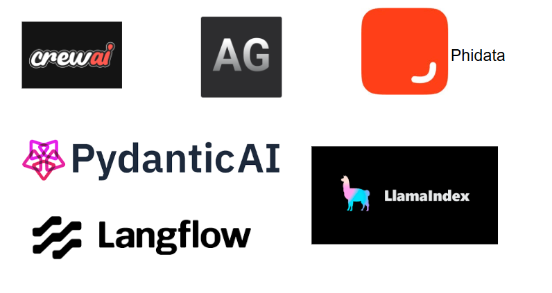
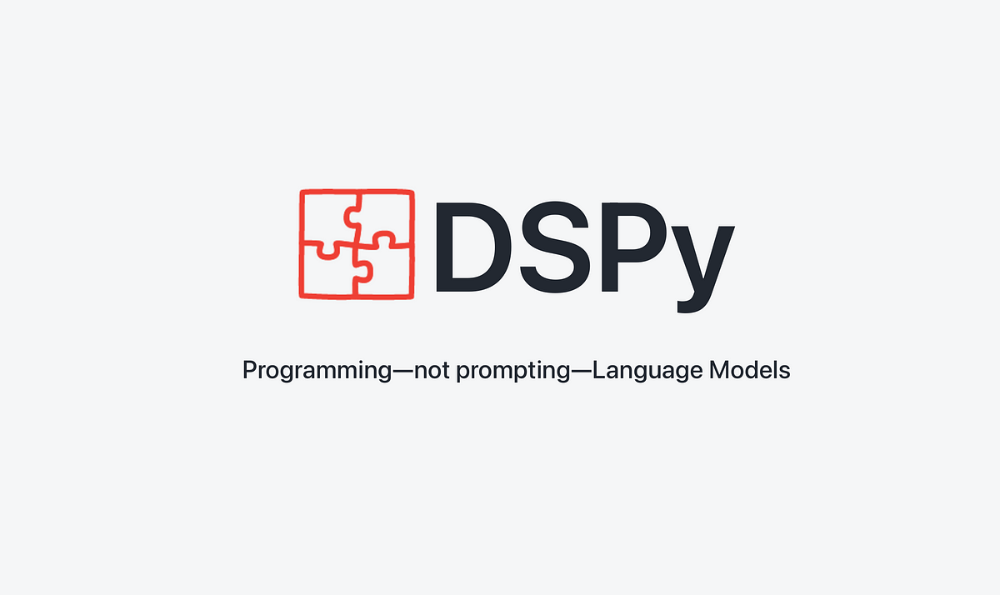

# Basic RAG

## Problems in system

1. When separting to fixed token chunks, it loses the relavent infomration
 ex: 1 paragraph 250 word and 2nd paragraph 300 words, if we set chunk size to fixed we are unable to capture meaning

!!! Numerical data representation will be inaccurate in above approach !!
# Vector Databases

*  FAISS only vector search algorithm not as a vector database functionalities

- Vector - Mathematical way of representing words

## Embedding 
A meaningful vector representation

- Max tokens
- Dimension

embedding for 5 tokens and 100 tokens are dimensions are same - compressing lot of info

## Indexing Technqiues
1. LSH - Locality-Sensitive Hashing
2. HNSW - Hierarchical Navigable Small World
3. IVF - Inverted File Index 

Used to organize the embedding vectors

## Retrival algorithms
1. ANN
2. KNN - Top K 
3. Hybrid Search

# LLM AI Agents frameworks

- CrewAI -- Agents, Crew, Process, Tasks

** Pydantic is used for data validation 
ex: name : str = "Manith" **

### DSPY (declarative self improving python)
- Not LLM prompting, programtically prompting

## MCP (Model Context Protocol)
- Anthropic (ClaudeAI) for common protocol

Components in MCP Server

