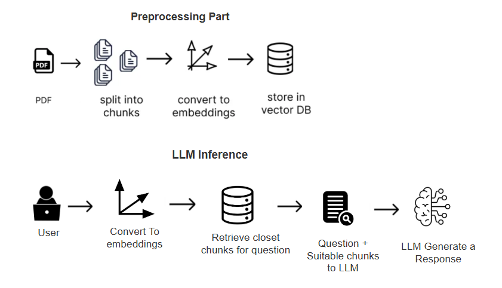
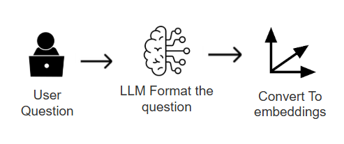
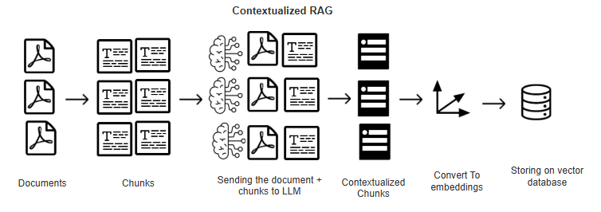
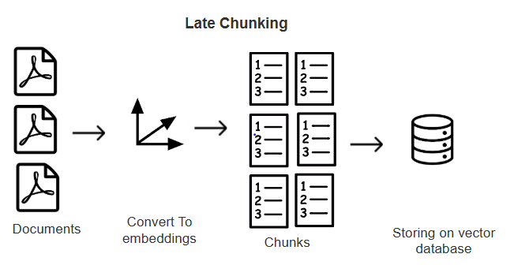
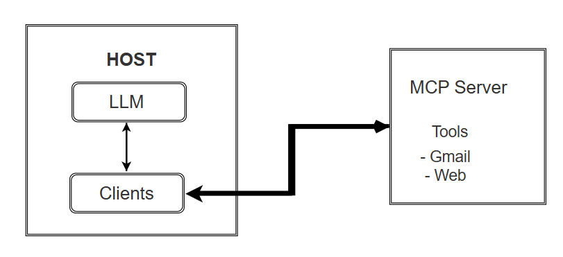

# Basic RAG System

## Problems in system

1. When separting to fixed token chunks, it loses the relavent infomration
 ex: 1 paragraph 250 word and 2nd paragraph 300 words, if we set chunk size to fixed we are unable to capture meaning

** Numerical data representation will be wrong**

# Vector Databases

*  FAISS only vector search algorithm not as a vector database functionalities

## Embedding 
- Max tokens
- Dimension

embedding for 5 tokens and 100 tokens are dimensions are same - compressing lot of info

## Indexing Technqiues
1. LSH - Locality-Sensitive Hashing
2. HNSW - Hierarchical Navigable Small World
3. IVF - Inverted File Index 

Used to organize the embedding vectors

## Retrival algorithms
1. ANN
2. KNN - Top K 
3. Hybrid Search

Before searching relavent vectors need to format user Question for better Retrival from vector database

# CAG (Cache Augmented Generation)
* RAG vs CAG 

It loads whole data into model - now LLMs have large context windows

# GraphRAG
High Accuracy but need to do multiple LLM calls, this makes it slow

- Microsoft Graph Rag - Requires a API key Ollama is not supproted yet
- neo4j

# LightRAG
* Much more effective than GraphRAG

## Contextual Retrieval

## Late Chunking

# Image To Text conversion in RAG

### OCR (Optical Character Recognition)

### ColPali
Vision LLM : Can capture the text in the images : multimodels

# KAG (Knowledge Augmented Graph)
It built on OpenSPG engine solve RAG and GraphRAG limitation

# LLM AI Agents frameworks

- CrewAI :: Agents, Crew, Process, Tasks
- PydanticAI 

** Pydantic is used for data validation 
ex: name : str = "Manith" 

- Autogen
- LlamaIndex
- LangGraph

### DSPY (declarative self improving python)
- Not LLM prompting, programtically prompting

## RAPTOR  (Retrival Abstractive Processing Tree Organized Retrieval)

RAPTOR is RAG framework
RAG - Relies on chunks
RAPTOR - Bottom up approach -> Clustering and summarizing chunks

## ColBERT (Contextualized Late Interaction over BERT)
- Efficent than traditional RAG

** Research papers are available for above every method with comparision and evaluations

## Evaluating RAG systems
### RAGAS (Retrieval Augmented Generation Assessment)

Metrics 
- Faithfulness
- Context Recall
- Answer relavency

# MCP (Model Context Protocol)
- Anthropic for common protocol

Components in MCP Server

